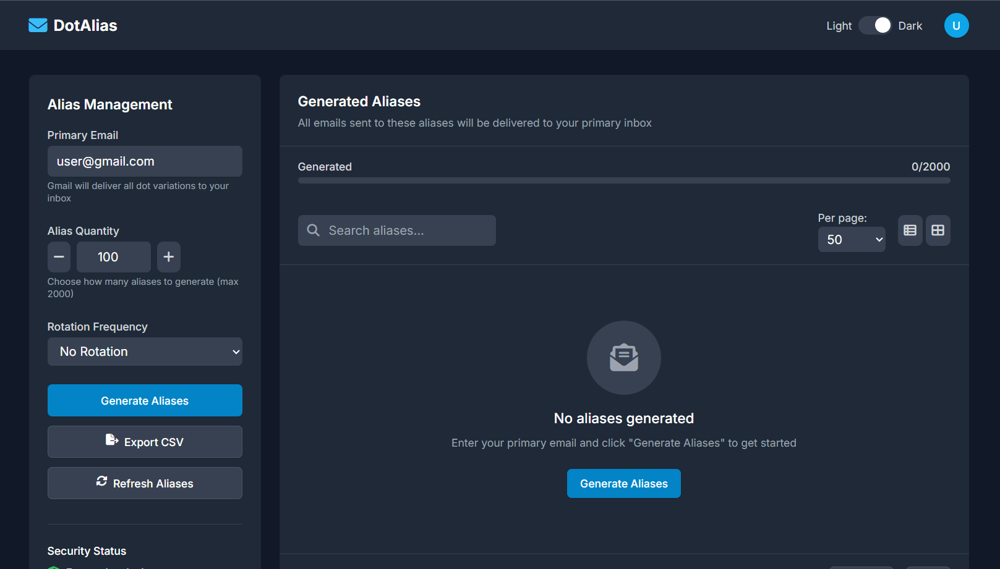

# DotAlias
Generate secure and unique Gmail aliases with dot variations. Protect your primary email address from spam and enhance your online privacy.
DotAlias is a project designed to simplify and enhance your workflow by managing aliases efficiently. This repository provides tools and documentation to help you set up and use DotAlias seamlessly.

## 🚀 Live Preview
<p align="center">
  <a href="https://rahul-sharma-alx.github.io/DotAlias/" target="_blank">
    
  </a>
</p>

You can preview the project here: [DotAlias Live Preview](https://rahul-sharma-alx.github.io/DotAlias/)

## 📦 Features

- Easy alias management
- User-friendly interface
- Quick setup and configuration
- Customizable for various use cases

## 🛠️ Getting Started

1. **Clone the repository**
   ```bash
   git clone https://github.com/rahul-sharma-alx/DotAlias.git
   ```
2. **Navigate to the project directory**
   ```bash
   cd DotAlias
   ```
3. **Open the project**
   - You can open the project files in your preferred code editor.
   - Or visit the [Live Preview](https://rahul-sharma-alx.github.io/DotAlias/) to see it in action.

## 📄 Documentation

Comprehensive documentation is available within the repository to guide you through the setup process and advanced features.

## 🤝 Contributing

Contributions are welcome! Please open issues or submit pull requests for any improvements or bug fixes.

## 📃 License

This project is licensed under the MIT License.

---

Enjoy using **DotAlias** and streamline your workflow!
